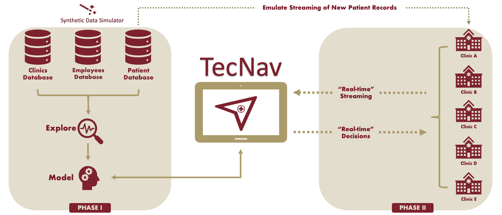
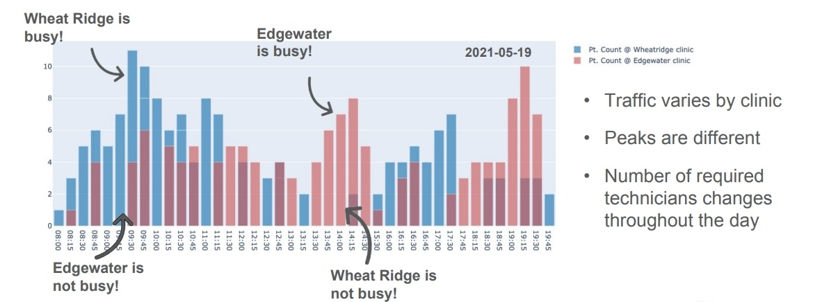
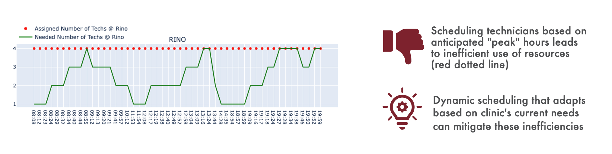
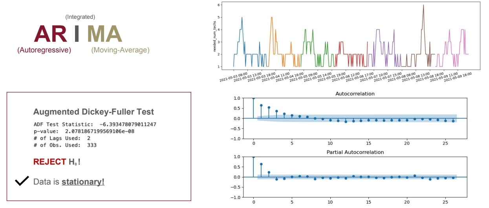
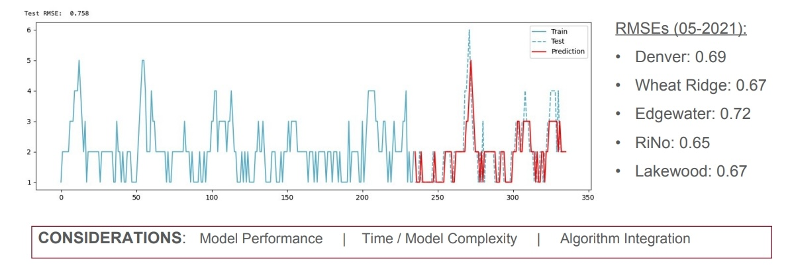
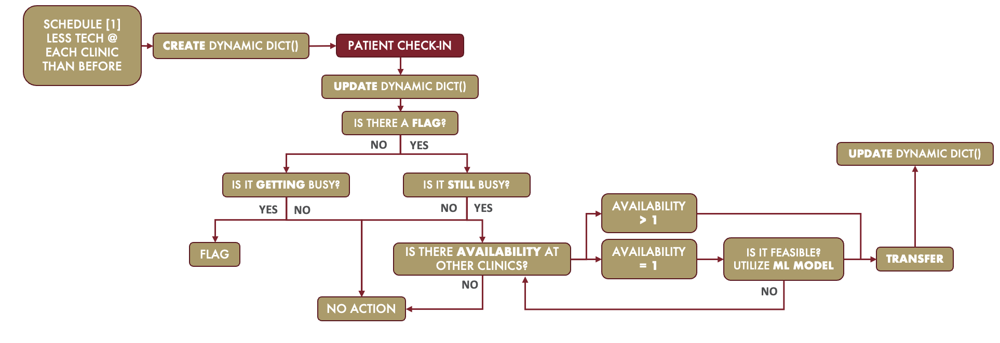
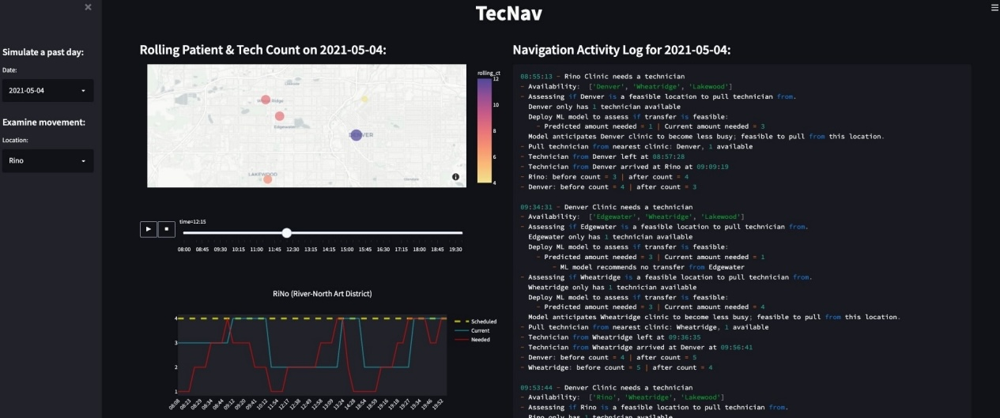

[![Issues][issues-shield]][issues-url]

[](https://user-images.githubusercontent.com/79323360/170838284-edba9418-8f2b-4ca1-a880-db3651fbe247.png)
<br />
<!---
<div align="center">
  <a href="https://github.com/rc-9/TecNav">
    
  </a>
-->


<h1 align="center">TecNav</h1>
<h3 align="center"> Urgent-Care Technician Navigation System</h3>
  <p align="center">
    University of Denver - Data Science Capstone 2022
    <br />
    Tomer Danon & Romith Challa
    <br />
    <br />
    <a href="https://github.com/rc-9/TecNav">View Repo</a>
    ·
    <a href="https://github.com/rc-9/TecNav/issues">Report Bug</a>
    ·
    <a href="https://github.com/rc-9/TecNav/issues">Request Feature</a>
  </p>
</div>


<!-- TABLE OF CONTENTS -->
<details>
  <summary>Table of Contents</summary>
  <ol>
    <li>
      <a href="#project-overview">Project Overview</a>
    <li><a href="#usage">Usage</a></li>
    <li><a href="#contact">Contact</a></li>
    <li><a href="#acknowledgments">Acknowledgments</a></li>
  </ol>
</details>


## Project Overview

#### Problem Context

According to a 2019 benchmark report from the Urgent Care Association, the number of urgent-care clinics increased by 9.6% from the previous year. 
As the pandemic continues to put a strain on the healthcare system, the appeal for convenient and affordable care-outlets is greater than ever. 
To meet this growing need for on-demand care, urgent-care clinics have been rapidly expanding the scope of their services to provide patients with a quick and affordable alternative to the emergency room. 
This proves to be a mutually exclusive endeavor as minimizing wait-times entails maximizing staff availability. 
Consequently, this leads to higher operational costs that eventually trickle down to patient bills. 
Due to the inconsistency in patient traffic, it is difficult to schedule staff to be able to handle the peak hours, without inevitably wasting resources during less busy hours. 
Some chain-operated clinics creatively handle this by transferring technicians between their various locations to account for the constantly evolving needs at each clinic. 
This requires continuous monitoring of each clinic to manually make navigation decisions based on the fluctuating patient traffic. 
Instead, a software application that streamlines this process to make real-time, data-driven navigation decisions would serve as an invaluable tool for these clinics. 
That is the motivation behind TecNav—an automated application that employs machine-learning to forecast the dynamic patient flow and navigate technicians without any human supervision. 
Based on the preliminary results of the prototype, TecNav can save clients over $90,000 for each clinic per year. 
This could potentially finance their mission to expand clinical services, without burdening patients with higher costs. 
Designed with an emphasis on translatability, TecNav’s algorithm is customizable to fit the needs of any potential client.
<br/>

#### Project Pipeline
<br/>



To better organize a project of this scale, it was divided into two distinct phases to separate the
data science workflow from the software engineering components. 


PHASE I: 

Due to privacy & security compliances, there are no publicly available datasets at the operational granularity required for this project. Therefore, Phase I focuses on generating synthetic clinical records using research-backed references, domain expertise, personal clinical experience, and statistically constrained processes to approximate real-world patient flow dynamics. The generated datasets are then explored and engineered to support the construction of ML models that serve as decision-makers within the software application of Phase II.

PHASE II:

The objective of Phase II is to design a strategic navigation algorithm and develop a robust decision-support software application. As part of a live demonstration, the system emulates a real-time data stream to evaluate its ability to make optimal navigation decisions under dynamic clinical conditions.

<br/>

#### Clinical Use-Case
<br/>



Patient influx is characterized by multi-modal distributions with distinct peaks and troughs, driven by factors such as time of the day, day of the week, seasonal effects, clinic location, etc. This variability results in dynamic, time-dependent staffing requirements throughout day-to-day operations.

<br/>

#### Proposed Solution
<br/>



An application that continuously monitors the evolving needs of each clinic can automate technician navigation decisions without human supervision. By leveraging machine learning models to forecast the dynamic patient flow, the system optimizes clinical efficiencies and reduces operational costs, helping urgent care clinics preserve their position as affordable alternatives to emergency departments.

<br/>


#### Modeling
<br/>



Several machine-learning techniques were explored during the modeling stage to identify an effective forecasting approach for patient traffic flow, including tree-based ensemble methods (e.g., random forest) and time-series models (e.g., ARIMA). In ARIMA, the autoregressive ('AR') component models future values using past observations at specified time intervals, while the moving average ('MA') component accounts for past forecast errors by incorporating error terms from previous intervals into the regression equation.



The goal of the modeling stage was to identify a clinically effective yet computationally efficient predictor suitable for deployment within the software algorithm. This achieved an RMSE below 0.8, which translates to a maximum potential prediction error of approximately one technician. This level of precision is sufficient to support staffing and navigation decisions without introducing meaningful clinical risk, while maintaining low computational overhead for continuous use within the application.

<br/>


#### Custom Algorithm: Decision-Tree
<br/>



The TecNav algorithm serves as the decision-making core of the application. It continuously monitors clinic-level operational status and invokes machine learning forecasts only when navigation decisions are required. To ensure reliability under all operating conditions, the system is implemented as a strategic, decision-tree style algorithm that deterministically evaluates every possible transfer scenario.

In contrast to manual navigation (where transfer decisions rely on subjective judgment or potentially biased experience), TecNav bases its actions on historical data learned through model training. The forecasting model can be periodically retrained to capture evolving patient-flow patterns and emerging clinical trends. When a technician becomes available, the algorithm evaluates whether they are predicted to be needed at their current clinic. If so, it proceeds to the next clinic in the availability queue. If no eligible transfers exist, the system records the outcome and takes no action. Otherwise, a transfer is initiated, internal state variables are updated, and the algorithm resets in preparation for the next patient arrival.

<br/>


#### DEMO: Prototype Application
<br/>



The prototype application showcases TecNav in action through a live, interactive dashboard. Users can  track real-time clinic activity (including new patient arrivals), and observe how the system optimizes staff allocation across multiple urgent care branches. This visual demo highlights the algorithm’s ability to dynamically respond to changing patient flow while maintaining operational efficiency.

<br/>


#### Results & Recommendations
<br/>

For an urgent-care chain with five branches, TecNav recommends scheduling five fewer technicians per day, relying on the automated system to cover gaps in demand across locations throughout the day.  

On average, this requires 357 technician moves per month, with an estimated $3,168 in yearly gas reimbursements. However, these costs are offset by overall yearly operational savings of:

#### <span style="color:green;">$91,980</span>\*

\*Minus a small TecNav subscription fee ;-)


<br/>


<p align="right">(<a href="#top">back to top</a>)</p>


## Usage

This section outlines the order to execute notebooks to generate, explore, and model the data, as well as build the software navigation application.
<br/> <br/>

1. ```uc_synthetic_data_simulator.ipynb```: As there are no publicly-available datasets that fit the scope of this project, this notebook generates synthetic urgent-care operational data using research-backed simulations, domain expertise, and statistically constrained processes to approximate real-world patient flow dynamics. 
<br/> <br/>

2. ```uc_eda.ipynb```: This notebook explores the simulation data to draw insights from the patient visits and any relationships between dates and times to inform the modeling and navigation process. 
<br/> <br/>

3. ```uc_modeler.ipynb```: This notebook constructs and evaluates baseline models to help select a decision-maker within the navigation software.
<br/> <br/>

4. ```uc_analysis.ipynb```: This notebook implements the technician navigation process to study the potential benefits in productivity and operational costs. 
This notebook utilizes ```uc_navigator.py``` and ```TecNav_Demo.py```.
<br/> <br/>

5. ```uc_navigator.py```: (FOR REFERENCE ONLY) Contains navigator application. This module is launched within ```uc_analysis.ipynb``` and ```TecNav_Demo.py```.
<br/> <br/>

6. ```TecNav_Demo.py```: (FOR REFERENCE ONLY) Contains demo dashboard application. This module is launched within ```uc_analysis.ipynb```.

<p align="right">(<a href="#top">back to top</a>)</p>


<!-- CONTACT -->
## Contact

* Tomer Danon - [tomer.danon@du.edu](tomer.danon@du.edu)
* Romith Challa - [romith.challa@du.edu](romith.challa@du.edu)

<p align="right">(<a href="#top">back to top</a>)</p>


## Acknowledgments

Data Science Capstone 2022 | Ritchie School of Engineering & Computer Science | University of Denver

<p align="right">(<a href="#top">back to top</a>)</p>


<!-- MARKDOWN LINKS & IMAGES -->
[issues-shield]: https://img.shields.io/github/issues/rc-9/TecNav.svg?style=for-the-badge
[issues-url]: https://github.com/rc-9/TecNav/issues

